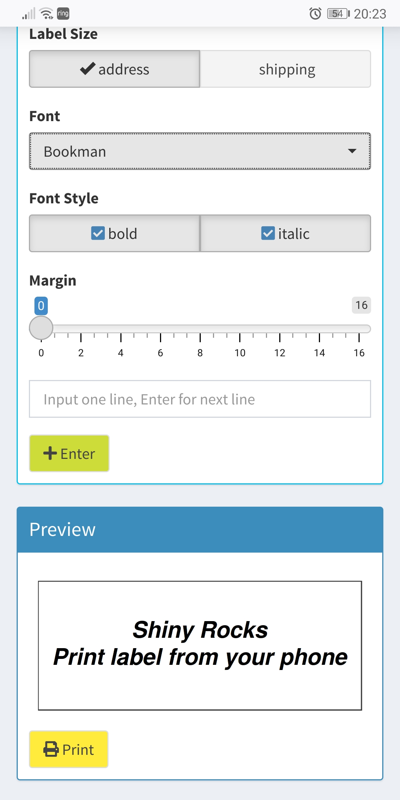

# pilabel
Shiny app that run in Raspberry Pi Shiny server, create, print label on Dymo LabelWriter.

## Setup
- [Setup Shiny server on Raspberry pi 3 B+](https://andresrcs.rbind.io/2021/01/13/raspberry_pi_server/) is a great guide with ansible playbook to automate most steps. You need a linux machine to run the playbook. I setup a virtualbox with Ubuntu in my windows PC to run the playbook. There were some additional steps I need to change based on the guide:
  - Setting static ip in pi doesn't work for me, it kept using assigned ip with multiple reboot. Maybe I didn't specify the right interface name because there is both Ethernet and wireless and I'm using wireless (no Ethernet port available) In the end I added it to address reservation in router so it should always use same ip.
  - ssh part can have multiple place went wrong but most problems can be solved with google search.
  - The git clone command have one dash before `--depth` wrong and not recognized, it looks to have some other dash in the blog so direct copy the line doesn't work.
  - There was a warning in first playbook install

    > [WARNING]: Module remote_tmp /root/.ansible/tmp did not exist and was created with a mode of 0700, this may cause issues when running as another user. To avoid this, create the remote_tmp dir with the correct permissions manually

    To solve this, I created a folder manually in my local machine (not pi) and add this line to `ansible.cfg` in the repo folder.

    remote_tmp = /tmp/.ansible/tmp
    
  - My first playbook installation failed because I didn't run `sudo apt-get update` in pi. 
  - I only installed the basic services(skip postgresql) and shiny server, I don't need RStudio server.
- [Add Dymo labelwriter printer to pi](https://johnathan.org/originals/2019/11/configure-a-raspberry-pi-as-a-print-server-for-dymo-label-printers.html). I'm using a Dymo labelwriter 400, and the simple method of installing driver worked for me(Any label printer that supported by CUPS should be fine for our setup, like Brother QL series etc). I'm using the pi in headless mode once ssh setup is done, so I need to [enable CUPS remote admin](https://serverfault.com/questions/836266/how-can-i-enable-remote-access-to-the-admin-page-in-cups) to add the printer though.

      sudo cupsctl --remote-any
      sudo ufw allow 631
      sudo /etc/init.d/cups restart
    
  - Find out the right command for printing with command like `lp` or `lpr`. For me the label writer is the only printer, and I will use two types of labels. I set one label as default for printer, then check the printer info with `lpoptions  -l`. You will find one media type have a * on it which is the default label. Now I knew the label's media type name. Use this method I found out the media name for 2 labels. I used my version of commands in the Shiny app. You will need to adjust it for your setup, so first test what command works for you then adjust the app.
- Setup the Shiny app.
  First install all the dependency packages by ssh into pi, run `R` into R console, install packages in R console with
  
  
      if (!require(pacman)) install.packages("pacman")
      pacman::p_load(grid, ggplot2, ggfittext, shiny, shinydashboard, shinyWidgets, lubridate, glue)
    
  Then quit R console with `q()`.
  Copy the `app_pilabel` folder to pi under `/srv/shiny-server` through winscp, then you can access the shiny app at http://your_server_ip/shiny/your_app_name.
    
- The app only listed 4 fonts, which should be available in pi. Adding other fonts available in R is simple but most doesn't make too much difference. You can add more from font listed in R command `names(pdfFonts())`. Adding fonts outside of R is tricky, especially when they may not get embeded into pdf. There are R packages like `showtext` and `extrafonts` that may help you on this.
  For now Chinese fonts is not supported. I can show and print Chinese in Ubuntu VM but not in pi. I tried to install Chinese fonts and setup Chinese locale in pi but still not working.